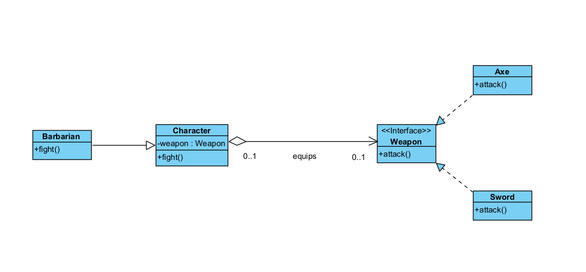
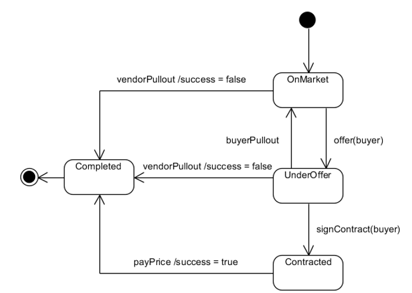
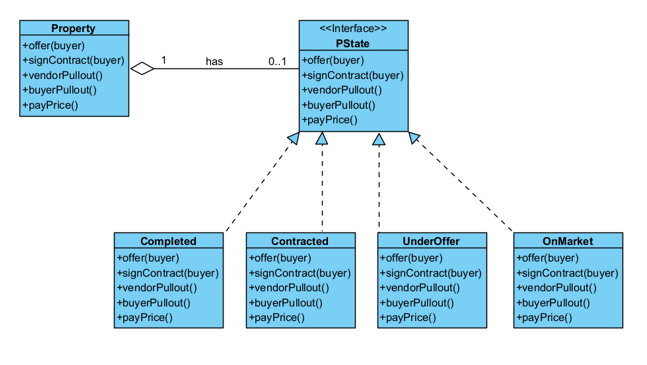

# Week 3 (State/Strategy Design Pattern)

## Activity 1



Implement the Strategy pattern such that running the following program will produce the desired output. 

```cs
// Program.cs
Character character = new Warrior();

Weapon sword = new Sword();
Weapon axe = new Axe();

character.MyWeapon = sword;
character.attack();
character.MyWeapon = axe;
character.attack();

// Expected Output:
// Attack with Sword
// Attack with Axe
```

<br>

## Activity 2
)
]

Implement the State pattern such that running the following program will produce the desired output.

```cs
// Program.cs
Property prop1 = new Property();
Buyer buyer = new Buyer();

prop1.offer(buyer);
prop1.buyerPullout();
prop1.signContract(buyer);
prop1.vendorPullout();
prop1.offer(buyer);

Console.WriteLine();
Property prop2 = new Property();
prop2.offer(buyer);
prop2.payPrice();
prop2.signContract(buyer);
prop2.buyerPullout();
prop2.payPrice();
prop2.vendorPullout();


/*
Expected Output:

Offer made.
Buyer pulls out.
No buyer to sign contract.
Vendor pulls out.
Cannot offer - sale is complete with success = False

Offer made.
Contract not yet signed.
Buyer signs contract.
Buyer cannot pull out - contract signed.
Price paid.
Vendor cannot pull out - sale is complete with success = True

*/
```